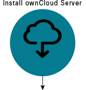
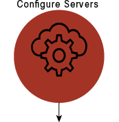
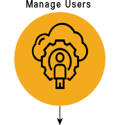

#ownCloud Server Quick Start Guide
ownCloud is a flexible open source file synchronization  and sharing solution. 

Install your own server to store and synchronize files. To learn more about ownCloud capabilities, see [ownCloud Administration Guide] (https://doc.ownCloud.org/server/latest/admin_manual/).

This quick start provides a list of common administrative workflow for an ownCloud server installation. What would you like to do?

 

