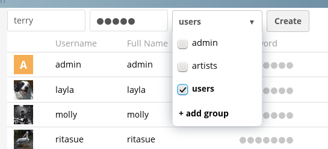

#  Add a User Account

Before users can log in, synchronize, or share data, they need an account. To add a new user account, go to your ownCloud web interface.

1. Log in using your administration credentials.
2. Enter a Login Name and a Password for the new user.  
2. Select **User** from the list.

3. Click **Create**.

The new user can now [access](access.md) your ownCloud server. 

For more information on User Management, see the latest [ownCloud Administration Manual](https://doc.owncloud.org/server/latest/admin_manual/configuration/user/).

## Related Information
* [Install ownCloud Servers](install.md)
* [Configure ownCloud Servers](Servers.md)
* [Access ownCloud Servers](access.md) 
* [ownCloud Quick Start Guide](../README.md)	